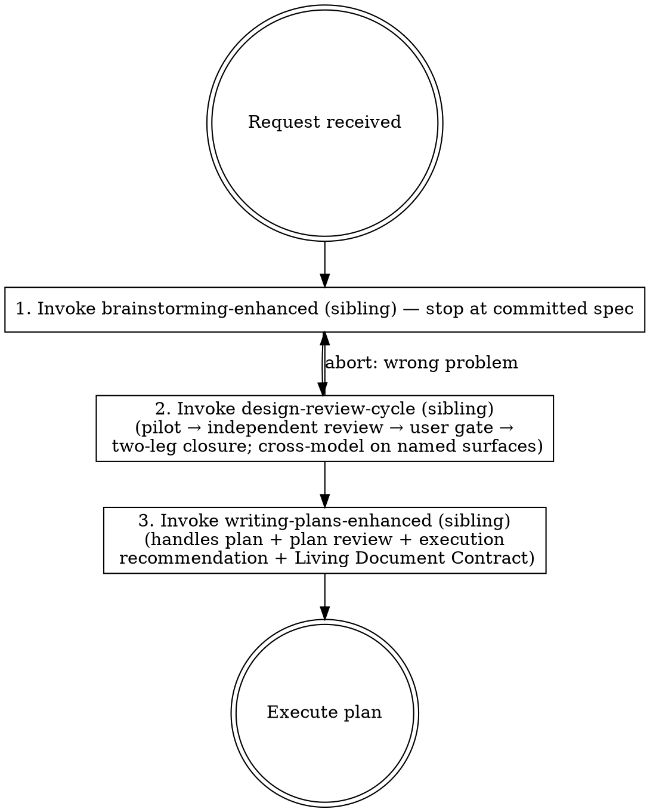

# Build Robust Features

## Terminology

<!-- approved-block: rfc2119-terminology v1 — authoritative copy: ../../approved-blocks.md -->
The key words "MUST", "MUST NOT", "REQUIRED", "SHALL", "SHALL NOT", "SHOULD", "SHOULD NOT", "RECOMMENDED", "NOT RECOMMENDED", "MAY", and "OPTIONAL" in this document are to be interpreted as described in BCP 14 [RFC 2119] [RFC 8174] when, and only when, they appear in all capitals, as shown here.
<!-- /approved-block: rfc2119-terminology -->

## Overview

End-to-end workflow for turning a feature request, bug fix, or project to-do into a subagent-ready implementation plan. Chains brainstorming, adversarial design review, and disciplined planning to prevent the most common subagent failure modes: ambiguity, context gaps, and interpretation drift.

This skill owns the **workflow spine**: brainstorming the design, then delegating each downstream discipline to its owner skill. Design review is delegated to the sibling [`design-review-cycle`](../design-review-cycle/SKILL.md); plan writing to [`writing-plans-enhanced`](../writing-plans-enhanced/SKILL.md), which in turn delegates plan review to [`plan-review-cycle`](../plan-review-cycle/SKILL.md). The runner MUST NOT re-implement any delegated discipline here — see §What this skill does NOT do (and why) for the reasoning.

## When to Use

- Building a new feature or enhancement
- Fixing bugs that require planned implementation
- Any work that will be delegated to subagents via `superpowers:subagent-driven-development` or `superpowers:executing-plans`
- When the user says "build", "implement", "add", "fix" for non-trivial work

**When NOT to use:**

- Quick one-line fixes
- Exploratory research or investigation
- Work you'll do entirely yourself in this session
- Plan-writing for work whose design has already been settled (skip straight to `writing-plans-enhanced`)

## Workflow

### Step 1: Brainstorm

The runner MUST invoke the sibling `brainstorming-enhanced` skill for the requested work, instructing it: **stop at the committed spec — this workflow owns design review and planning.** If the wrapper reports failed-precondition, stop and surface the message; do not fall back to invoking the base skill directly. If it reports stopped-with-open-questions, stop and surface the questions — they need the user, and design review on an incomplete spec wastes the review. If it reports anything other than spec-committed, stop and surface it. The output is a shared understanding of the user's intent, the requirements, and the design space — not yet a plan.

### Step 2: Adversarial Design Review

The runner MUST invoke the sibling [`design-review-cycle`](../design-review-cycle/SKILL.md) skill on the design that came out of brainstorming, and MUST NOT re-implement design review inline. The cycle owns the full discipline: a runner pilot, independent review at mode width (light default; full fan-out REQUIRED on named surfaces), a findings ledger with a batched user decision gate, a conditional re-sweep, and a two-leg closure (cold reader + ledger verifier, both clean). It is also the **canonical home of the cross-provider dispatch-and-fallback procedure** that previously lived in this step — see its §Cross-provider policy.

Handle its three terminal states: **completed** → proceed to Step 3. **Abort to brainstorming** (the gate concluded the design solves the wrong problem) → return to Step 1. **Stopped awaiting user** → do not proceed; the review's ledger holds the posed questions. (A Phase 0 readiness-gate stop — the artifact is not yet a reviewable design — is handled like abort: return to Step 1 and finish the design.)

This step is the unique value of `build-robust-features` over jumping straight to `writing-plans-enhanced`. Skipping it pushes design failures into the plan, where they cost more to find and fix.

### Step 3: Write the Plan

The runner MUST invoke the sibling [`writing-plans-enhanced`](../writing-plans-enhanced/SKILL.md) skill with the brainstormed-and-reviewed design as input, and MUST NOT invoke `superpowers:writing-plans` directly. `writing-plans-enhanced` is the right entry point because it layers in the subagent-proofing requirements, TDD mandates, pitfalls reviews, the **Living Document Contract**, the execution strategy recommendation, and (at its Step 4) the multi-round plan review cycle via the sibling [`plan-review-cycle`](../plan-review-cycle/SKILL.md). All three skills are siblings in this plugin — always present when this skill is.

### What this skill does NOT do (and why)

The previous version of this skill restated the subagent-proofing requirements (eliminate ambiguity / prevent context gaps / prevent interpretation drift / mandate TDD / check pitfalls / minimize cross-task conflicts) and an inline plan-review cycle. Those have moved entirely into `writing-plans-enhanced` and `plan-review-cycle`. Having them in one place — owned by the plan-writing skill, not duplicated here — means:

- The discipline can evolve without two skills drifting out of sync.
- Users who skip brainstorming and call `writing-plans-enhanced` directly still get the same subagent-proofing.
- This skill stays focused on its real contribution: brainstorming + orchestrating the delegated disciplines.

Future maintainers: subagent-proofing rules belong in `writing-plans-enhanced`, and design-review rules belong in `design-review-cycle` — not here. This skill's body SHOULD remain a thin spine (brainstorm + delegation + terminal-state handling); if you find yourself wanting to add review or proofing requirements here, add them to the owning sibling instead so they apply to every entry path (this skill, direct invocations, `bug-hunt-cycle` Phase 6, `health-review-cycle` Phase 4).

## Common Mistakes

- **Invoking `superpowers:brainstorming` directly** — bypasses requirements pinning, the spec-location convention, and plain-text questioning. Use the sibling `brainstorming-enhanced` skill.
- **Skipping the brainstorm** because "the user already explained what they want" — brainstorming surfaces requirements the user didn't think to articulate.
- **Skipping adversarial review** because "the brainstorm was thorough" — review catches a different class of problems (failure modes, hidden assumptions, contract drift).
- **Skipping the cross-model round on a named surface** — `design-review-cycle` requires it whenever an automated cross-provider primitive is available. Same-provider models share training-data biases exactly where they matter most (concurrency, data integrity, crash recovery, security). The graceful same-provider fallback exists for users without a second provider — it is a disclosed degradation, not the path of least resistance.
- **Calling `superpowers:writing-plans` directly** — bypasses subagent-proofing, the Living Document Contract, and the plan-review cycle. Use the sibling `writing-plans-enhanced` skill.
- **Re-implementing plan review here** — `writing-plans-enhanced` already runs `plan-review-cycle` at its Step 4. Adding another inline review cycle here is duplication that drifts out of sync.
- **Bolting extra ad-hoc review loops onto `design-review-cycle`'s output** — the cycle already folds fixes into the design and terminates on a clean two-leg closure. Its terminal state is binding: completed → Step 3; abort → Step 1. Improvised additional rounds after a clean closure are the manufacture failure its success definition names.

## Final gate — wire-walk (reachability)

**Before declaring the feature end-to-end shipped / done / complete, the runner MUST run the sibling [`wire-walk`](../wire-walk/SKILL.md) skill.** It is a hard gate, not advice. A feature that compiles, passes tests, and is CI-green is still not shipped if a real consumer can't reach it — the recurring defect is a correct, tested backend wired to nothing a user can touch (the seam between components is nobody's component, so nobody wires it).

`wire-walk` has the operator define the key user flows **greenfield** — the runner MUST NOT draft them, because anchoring launders the runner's own blind spots — then traces each flow verbatim to code (`file:line`), from its real starting state (fresh install / first launch / empty store / post-upgrade), hunting the universal break-patterns. **Any broken operator flow means the feature is NOT shipped** — that broken wiring is the real remaining work, not a follow-up. The runner MUST NOT claim done while one stands.

Like the downstream planning discipline, this gate is **delegated, not re-implemented here**: the brainstorm + `design-review-cycle` above get the design right, `writing-plans-enhanced` gets the plan right, and the sibling `wire-walk` skill owns proving a human can actually reach the shipped code. See [`wire-walk`](../wire-walk/SKILL.md) for the full procedure.
